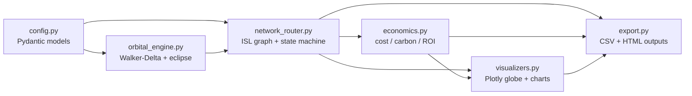
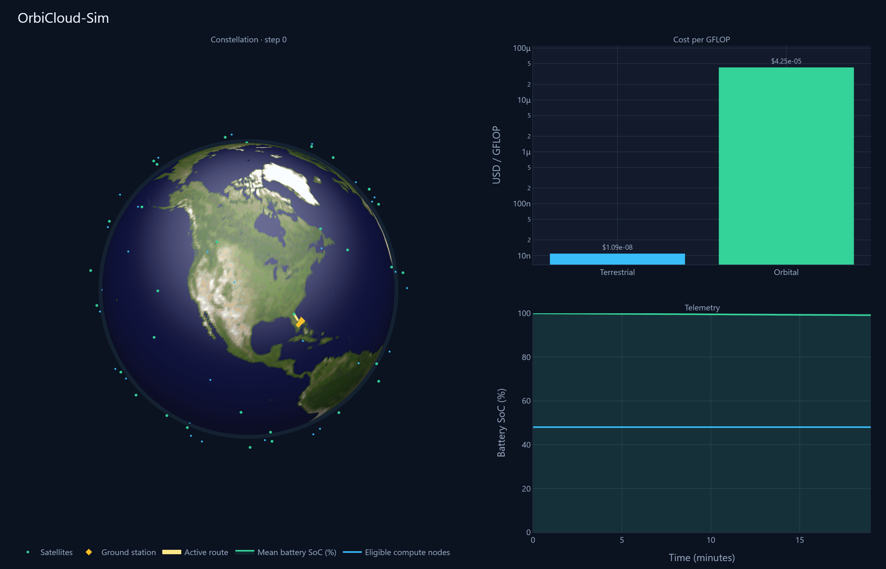
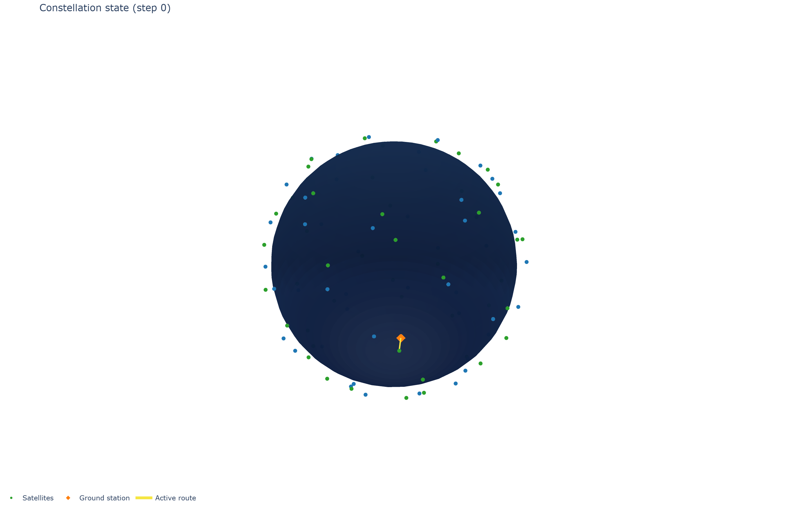
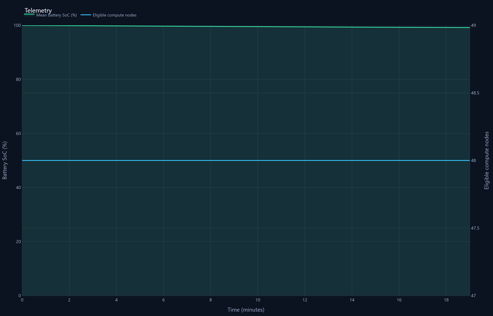
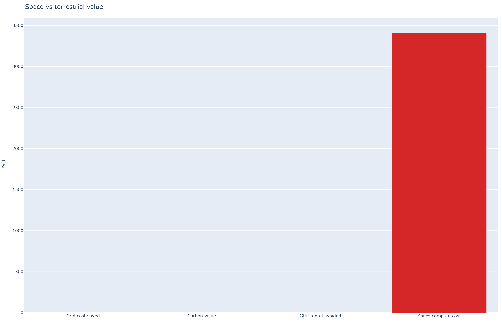

# OrbiCloud-Sim: Orbital Data-Center Constellation Optimizer

OrbiCloud-Sim is a Python simulation and techno-economic framework for
space-based data centers. It models a Low Earth Orbit (LEO) constellation that
executes AI compute workloads in orbit and writes CSV tables plus interactive
HTML visualizations for analysis.

The simulator couples four concerns:

- **Orbital mechanics** — Walker-Delta constellation generation and eclipse
  detection via Skyfield's SGP4 propagator.
- **Node state machine** — per-satellite battery and thermodynamic mass
  accumulation driven by sunlight, compute duty, and radiative cooling.
- **Dynamic routing** — a time-varying NetworkX line-of-sight graph with
  Earth-occlusion checks and health-penalized pathfinding.
- **Techno-economics** — CapEx/OpEx TCO with cooling premium, carbon offset,
  cost per GigaFLOP, and break-even horizon.

## High-Fidelity Engineering Constraints

The core engines replace binary academic switches with continuous physical
models:

### Dynamic ECEF Vector Occlusion

Optical inter-satellite links are admitted only when the chord between two
satellite position vectors clears the solid Earth. The closest-approach point
on the segment is found by projecting onto `V = sat2 − sat1`, clamping the
parameter to `[0, 1]`, and rejecting the edge when that point lies inside an
occlusion sphere of radius `R_earth + 100 km`. The **100 km atmospheric
boundary layer** accounts for thermal and signal-distortion altitude above the
mean Earth radius (`6371 km`). Globe snapshots are stored in ECEF so continents
remain fixed under the constellation while physics continues in ECI.

### Thermodynamic Accumulation

Node temperature is not a binary sunlit/eclipse flag. Each timestep integrates
a lumped thermal-mass ODE in kelvin: solar heating while `is_sunlit()` is true
(`+0.5 K/s`), intensive internal heat while AI compute is active (`+2.0 K/s`),
and continuous passive radiative cooling toward deep space
(`−coeff · (T − 3 K)`). Temperature therefore exhibits **continuous thermal
lag**—nodes heat and cool over successive intervals—and is clamped between a
safe storage floor (`250 K`) and a structural maximum (`360 K`). Compute
eligibility still requires temperature below the hardware thermal threshold and
battery above the configured floor.

### Health-Penalized Shortest Path Routing

Valid ISL edges that survive occlusion are not weighted by physical distance
alone. Pathfinding uses NetworkX `shortest_path(..., weight="weight")` where
edge cost scales with node health: if the target's battery falls below **20%**
or its temperature exceeds **90%** of the thermal threshold, the edge weight is
multiplied by **1000×** (distance × health penalty). Critically discharged or
structurally overheated nodes are omitted from the graph entirely
(`weight = ∞`). The resulting routes prefer thermally and electrically healthy
compute nodes rather than the geometrically nearest degraded ones.

## Architecture



Business logic lives in `src/orbicloud_sim/`. Presentation is limited to Plotly
HTML figures written beside the CSV exports.

## Project layout

```text
OrbiCloud-Sim/
├── src/orbicloud_sim/
│   ├── config.py            # Pydantic models: hardware, constellation, sim, economics
│   ├── presets.py           # Named scenarios: baseline_550, small_demo, dense_workload
│   ├── orbital_engine.py    # Skyfield Walker-Delta TLE synthesis + eclipse detection
│   ├── network_router.py    # NetworkX ISL graph, node state machine, run_simulation
│   ├── economics.py         # Dual-lens TCO: fleet CapEx vs utilized-compute metrics
│   ├── visualizers.py       # Plotly 3D globe and metric charts
│   ├── export.py            # CSV tables + HTML visualization writers
│   └── cli.py               # Headless runner (orbicloud)
├── docs/images/             # README dashboard screenshots
├── tests/test_orbital.py
├── pyproject.toml
└── README.md
```

## Installation

```bash
python -m venv .venv
# Windows PowerShell:  .venv\Scripts\Activate.ps1
# macOS/Linux:         source .venv/bin/activate
pip install -e ".[dev]"
```

Skyfield uses built-in timescale data and a low-precision analytic solar vector,
so no external TLE catalog or JPL ephemeris download is required.

## Usage

Named presets load a full scenario; CLI flags override individual fields:

| Preset | Description |
|--------|-------------|
| aseline_550 | Default Walker 8×12 at 550 km, 6000 s window (README baseline) |
| small_demo | Faster smoke run: 4×10 constellation, 180 s |
| dense_workload | Baseline geometry with a heavier per-step AI workload |

`ash
orbicloud --preset baseline_550 --output output/run
orbicloud --preset small_demo --output output/demo
orbicloud --preset dense_workload --output output/dense
`

Override constellation or window after selecting a preset:

`ash
orbicloud --preset baseline_550 --planes 8 --per-plane 12 --altitude-km 550 --duration-s 6000 --output output/run
`

Open output/run/dashboard.html in a browser for the combined globe, economics,
and telemetry view. Individual charts are also written as globe.html,
	elemetry.html, and economics.html, alongside CSV tables for further analysis.

Omit --output to print only the console summary:

`ash
orbicloud --preset baseline_550
`

## Baseline results (550 km)

The following metrics were produced by a headless run of the aseline_550
preset (load_preset("baseline_550") / default_simulation_config()), not
hand-tuned. Economics are reported under two lenses:

- **Fleet CapEx** — full constellation hardware + launch amortized over the
  simulated window and lifetime.
- **Utilized compute** — compute-node CapEx scaled by observed utilization
  (delivered GFLOP / constellation compute capacity over the window).

| Parameter | Value |
|-----------|-------|
| Orbit | 550 km, 53° inclination, Walker 8×12 (96 sats, 50% compute) |
| Ground station | Cape Canaveral (28.39°N, 80.60°W) |
| Window | 6000 s (100 steps × 60 s) |
| Launch CapEx | /kg rideshare |
| Lifetime | 5 years |
| Terrestrial reference | 67 TFLOP/s GPU, 700 W, PUE 1.5, .12/kWh, .50/h rental |

| Metric | Result |
|--------|--------|
| Jobs routed | 88 / 100 timesteps (88% feasible) |
| Delivered compute | 3.54×10⁸ GFLOP |
| Observed utilization | 1.83% |
| Mean route latency | 19.2 ms |
| Facility energy avoided | 1.54 kWh |
| Carbon offset | 0.62 kg CO₂ |
| OpEx energy savings (IT + cooling premium) | .18 |
| GPU rental avoided | .67 |
| Constellation CapEx (hardware + launch) | .4 M |
| Compute-node CapEx (subset) | .4 M |
| **Fleet CapEx — cost per GFLOP** | **.90×10⁻⁵** |
| **Fleet CapEx — break-even** | **~2.12×10⁵ months (~17,650 years)** |
| **Utilized compute — cost per GFLOP** | **$3.25×10⁻⁵** |
| **Utilized compute — break-even** | **~1.77×10⁵ months (~14,730 years)** |

Under these baseline assumptions both horizons remain CapEx-dominated: a full
96-satellite constellation (~ M fleet; ~ M compute nodes) is amortized
against OpEx savings from roughly one terrestrial GPU-hour of work per simulated
hour at ~1.83% observed utilization. The fleet lens reflects constellation-scale
investment; the utilized-compute lens attributes cost only to compute CapEx at
the observed duty factor. Neither metric is a single-node operating cost. Longer
duty cycles, denser workloads (--preset dense_workload), or smaller
constellations move both metrics; re-run orbicloud with altered --preset /
--planes / --per-plane / --duration-s to regenerate the table.

## Dashboard screenshots

Combined dashboard (globe, economics, and telemetry):



3D constellation globe with NASA Blue Marble Earth texture (continental US view):



Telemetry time series:



Unit-cost and impact comparison (fleet vs utilized-compute lenses; avoids short-window CapEx scale distortion):



## Testing

```bash
pytest
```

## Modeling notes

- **Walker-Delta** patterns are synthesized directly as NORAD TLE strings (mean
  motion derived from altitude), so SGP4 propagation is reused without external
  data files.
- **Eclipse / sunlight** uses a cylindrical Earth-shadow test (`is_sunlit`);
  penumbra is out of scope. Sunlight status feeds the thermal accumulator rather
  than acting as a binary compute switch.
- **ISL geometry** uses the vector occlusion test described above
  (`R_earth + 100 km` atmospheric boundary).
- **Economics** amortizes rideshare launch CapEx ($1500/kg) and hardware over
  a 5-year lifetime, credits OpEx savings from avoided grid IT load plus PUE
  cooling premium, and reports dual-lens cost per GFLOP and break-even (fleet
  CapEx vs utilized compute at observed utilization).

All tunable parameters are Pydantic models in `config.py`; there are no hardcoded
magic numbers in the simulation logic.
