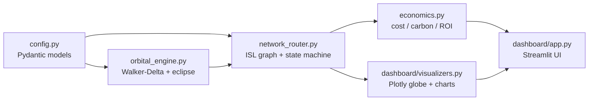

# OrbiCloud-Sim: Orbital Data-Center Constellation Optimizer

OrbiCloud-Sim is a Python simulation and techno-economic optimization framework
for **space-based data centers**. It models a Low Earth Orbit (LEO) constellation
that executes AI compute workloads (LLM inference, sensor fusion) *in orbit*
instead of downlinking raw data to Earth, and produces a dashboard comparing the
cost, carbon, and latency of "Space Compute" versus "Terrestrial Compute".

The simulator couples four concerns:

- **Orbital mechanics** - Walker-Delta constellation generation and eclipse
  detection via Skyfield's SGP4 propagator.
- **Node state machine** - per-satellite battery and thermal evolution driven by
  the sunlight/eclipse cycle and compute duty.
- **Dynamic routing** - a time-varying NetworkX line-of-sight graph plus
  state-aware pathfinding that avoids overheated or battery-starved nodes.
- **Techno-economics** - terrestrial energy and carbon avoided, amortized
  orbital capex, cost per GigaFLOP, and ROI.

## Architecture



Business logic lives in `src/orbicloud_sim/`; the Streamlit layer in `dashboard/`
is presentation-only.

## Project layout

```text
OrbiCloud-Sim/
├── src/orbicloud_sim/
│   ├── config.py            # Pydantic models: hardware, constellation, sim, economics
│   ├── orbital_engine.py    # Skyfield Walker-Delta TLE synthesis + eclipse detection
│   ├── network_router.py    # NetworkX ISL graph, node state machine, run_simulation
│   ├── economics.py         # Cost-per-GFLOP + carbon-offset model
│   └── cli.py               # Headless runner (orbicloud)
├── dashboard/
│   ├── app.py               # Streamlit entry point
│   └── visualizers.py       # Plotly 3D globe + metric charts
├── tests/test_orbital.py    # Pytest cases
├── pyproject.toml
└── README.md
```

## Installation

```bash
python -m venv .venv
# Windows PowerShell:  .venv\Scripts\Activate.ps1
# macOS/Linux:         source .venv/bin/activate
pip install -e ".[dev]"
```

Skyfield uses **built-in timescale data** and a low-precision analytic solar
vector, so no external TLE catalog or JPL ephemeris download is required.

## Usage

Run the interactive dashboard:

```bash
streamlit run dashboard/app.py
```

Or run a headless scenario and print the economic summary:

```bash
orbicloud --planes 8 --per-plane 8 --altitude-km 550 --duration-s 6000
```

## Testing

```bash
pytest
```

## Modeling notes

- **Walker-Delta** patterns are synthesized directly as NORAD TLE strings (mean
  motion derived from altitude), so SGP4 propagation is reused without external
  data files.
- **Eclipse** uses a cylindrical Earth-shadow approximation, standard for LEO
  feasibility studies; penumbra is out of scope.
- **Thermal** state uses a first-order lumped-capacitance model; a compute node
  accepts work only when it is below its thermal threshold and above its battery
  floor.
- **Economics** compares avoided terrestrial GPU energy (with PUE) against
  launch + hardware capex amortized over the satellite lifetime.

All tunable parameters are Pydantic models in `config.py`; there are no hardcoded
magic numbers in the simulation logic.
